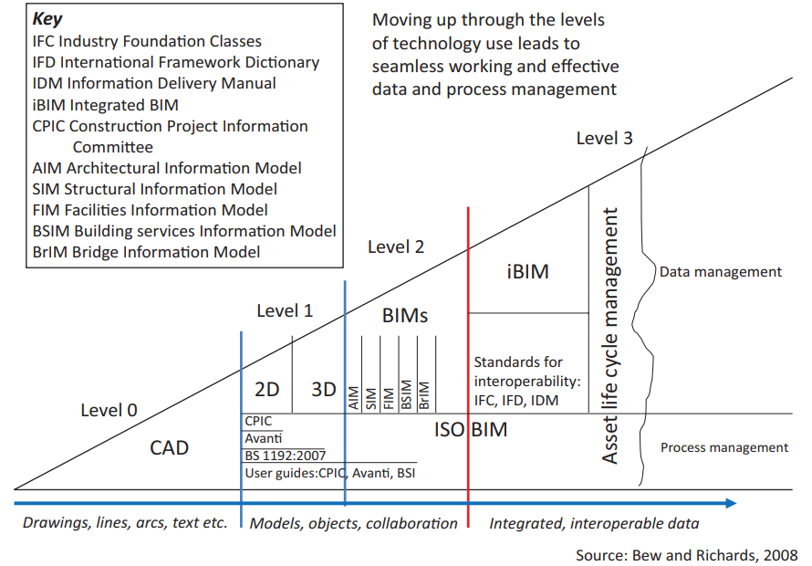

# Níveis de maturidade do BIM

<!-- Succar, Bilal & Kassem, Mohamad. (2015). Macro-BIM adoption: Conceptual structures. Automation in Construction. 57. 64-79. 10.1016/j.autcon.2015.04.018.  -->

O nível de maturidade do BIM ainda é um objeto de discussões e controvérsias. A Grã-Bretanha foi um dos primeiros países a estabelecer critérios objetivos para a definição dos níveis de maturidade do BIM. Por conta deste pioneirismo, o site [BIMDictionary.com](bimdictionary.com) utiliza o padrão Britânico para definir os níveis de maturidade do BIM.

## BIM Nível 0
[https://bimdictionary.com/pt/level-0-bim/1](https://bimdictionary.com/pt/level-0-bim/1)

O mais baixo dos Níveis BIM do Reino Unido sinalizando a ausência de colaboração; o uso exclusivo de desenhos em CAD 2D; e a distribuição de documentos através de e/ou impressões eletrônicas

## BIM Nível 1
https://bimdictionary.com/pt/level-1-bim/1

Um dos Níveis BIM do Reino Unido. O BIM Nível 1 refere-se a uma composição de modelagem 3D e desenhos 2D (para emissões). Os padrões de CAD seguem as normas BS 1192: 2007, e o compartilhamento eletrônico de dados é feito através de um Ambiente Comum de Dados (CDE). Neste nível, não há colaboração entre diferentes disciplinas pois cada uma publica e mantém seus próprios modelos, documentos e dados.

## BIM Nível 2
https://bimdictionary.com/pt/level-2-bim/1

Um dos Níveis BIM do Reino Unido. O BIM Nível 2 refere-se a práticas colaborativas de trabalho onde as partes geram seus próprios modelos 3D e compartilham informações através do Ambiente Comum de Dados (CDE) usando formatos de arquivo comuns.

## BIM Nível 3
https://bimdictionary.com/pt/level-3-bim/1

O mais alto dos Níveis BIM do Reino Unido. O BIM Nível 3 refere-se a processo e integração de dados "totalmente abertos" suportados por serviços web (web services); em conformidade com os padrões emergentes Industry Foundation Classes (IFC) e Dicionário de Dados buildingSMART (anteriormente IFD); E gerenciado por um Servidor de Modelos colaborativo. Este nível também é conhecido como iBIM (BIM integrado) e pode potencialmente empregar processos de engenharia concorrentes

[Comentários sobre os níveis de maturidade do BIM segundo a definição da Grã-Bretanha](https://www.youtube.com/watch?v=bxTDxI_oqhM&t=327s)