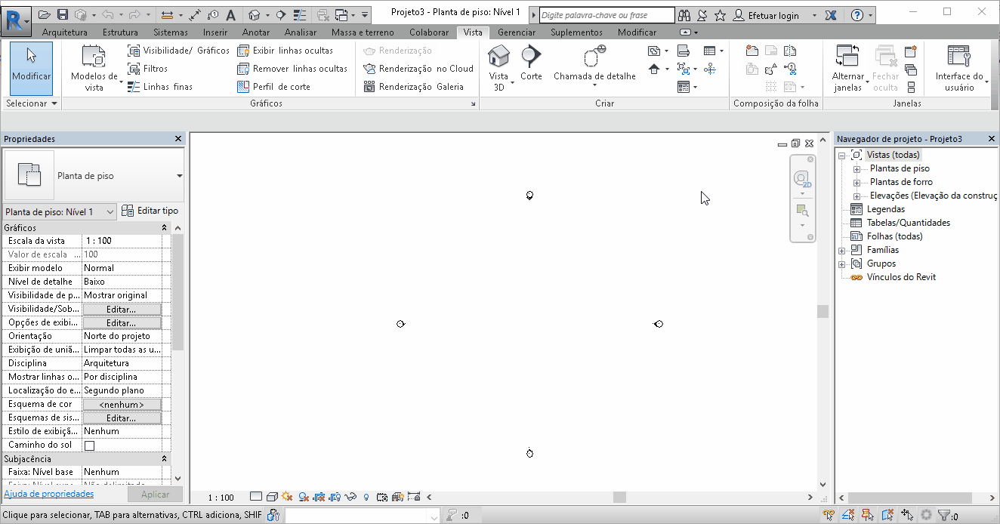
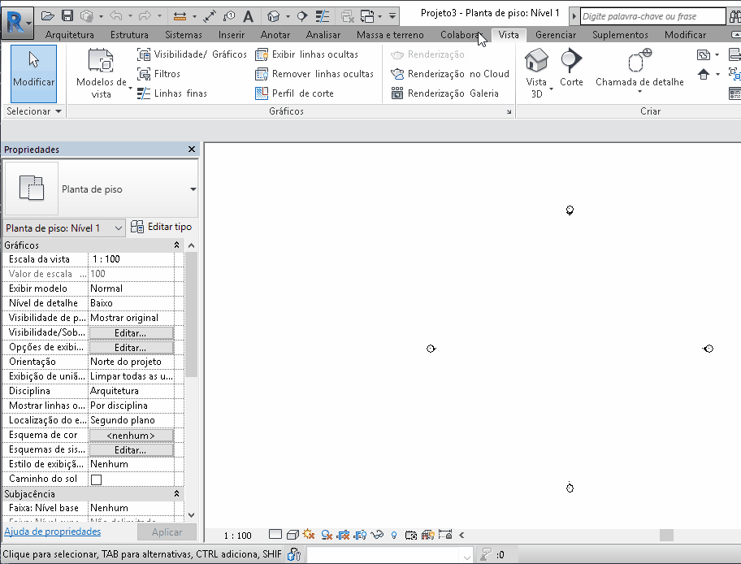

# Introdução ao Revit

# Informática e Desenho II

Prof. Fernando Ferraz Ribeiro \| fernando.ribeiro@ufba.br

Profa. Natalie Johanna Groetelaars \| natgroet@ufba.br

Profa. Bruna Bittencourt Costa

____

## *Moodle* da Disciplina

[ARQA37 - 2021.2 - Informática e Desenho II](https://ava.ufba.br/course/view.php?id=43367)

____

## [Edital das Avaliações](./revit/EditaisDasAvaliacoes/Readme.md)

____

## Plano de Aulas

____

### Aula 01

1. Apresentação do curso

    * Metodologia
    * Avaliações

1. Funcionamento do Laboratório

1. Introdução ao BIM
    * Conceito
    * Bim x CAD
    * Ciclo de vida das edificações
    * Modelagem paramétrica

1. Interface do programa

    

    * Tela inicial
      * Abrindo um projeto / *Templates* de projeto
      * Abrindo um arquivo de famílias / *Templates* de Famílias
    * Menu do aplicativo
      * Botões simples e botões *split*
      * Salvando um arquivo
      * Configurando número de cópias de segurança
    * Barra de acesso rápido
      * Uso e configuração
    * *Ribbon* (faixa)
      * Abas
      * Painéis
      * Botões simples
      * Botões duplos
      * Expansão de painéis
      * Lançadores de diálogo
      * Menu de contexto
    * *Options Bar* (barra de opções)
    * *Project Browser* (navegador de projeto)
        * Abrindo e fechando o navegador de projetos \| menu vistas -> interface do usuário -> navegador de projetos

    * *Properties Pallets* (PP) (propriedades)
        * *Type Selector* (Seletor de Tipos)

1. Instalação do Programa

1. Referências e Links

____

### Aula 02

1. Ajustes iniciais
    * Unidades de desenho
    * Cópias de segurança
    * Planos de referência (RP)
    * Níveis (LL)
        * relação entre níveis e vistas
    * Trabalhando com os níveis
        * Lajes conectadas aos níveis
        * Paredes entre dois níveis
1. Exercício 01
    * Definindo os níveis
    * Subjacência
    * Desenhando lajes
    * Desenhando paredes
    * Portas e janelas
        * Hierarquia dos elementos no Revit
            * Categoria
            * família
            * Tipo
            * instância
1. Paredes de cortina
    * Montante
    * Painéis

___

[Exercício casa Noruega](./revit/materialDeExercicios/CASA_NOROEGA_TYIN_Tegnestue_Architects.zip)

____

#### Exercício: [Instruções para modelagem das massas](./revit/EstudoDeMassas-e01/Readme.md)

____

### Aula 03

[Exemplo Rhino](./revit/EstudoDeMassasTesteRhino/teste_rhino_01.3dm)

[Exemplo SketchUp](./revit/EstudoDeMassasTesteSketchUp/testeSketchUp.skp)

1. Modelagem a partir de massas

   * Modelagem no local

   * Importando sólidos modelados em outros programas

1. Paredes
    * Materiais
    * Camadas
    * Paredes Empilhadas
    * Cortinas de vidro
        * Eixos
        * Montantes
            * Perfis
        * Painéis
        * Esquadrias

1. Pisos

    * Materiais
    * Camadas
    * *Steel Deck*
    * Vãos

1. Cobertura

1. União e divisão de elementos

1. Referências e Links

    [Tutorial de massas no Revit(ENG) M Smith](https://www.youtube.com/watch?v=1hqkX6IW6MQ&list=PL5fgrebBtwJIgZ9gH32qJ0WQYC1-avW2f)

    [Tutorial de exportação do Sketchup para o Revit](https://www.youtube.com/watch?v=qShQSwh33Bs)

____

### Aula 04

[Bases Mies](./revit/materialDeExercicios/Farnsworth-Mies.zip)

1. Malha de Pilares
    * Comando Grid (GR)
    * criação de pilares
        * Pilares estruturais
        * Colunas arquitetônicas
        * Editor de famílias
1. Vigas
    * Carregando famílias
    * Editor de famílias
    * Sistemas de vigas
1. Base vetorial
    * Lajes
    * Paredes

1. Fundações
    * Inserção de Fundações

1. Treliças
    * Editor de famílias
    * Inserção de treliça
1. Coberturas
        * Cobertura por extrusão
        * Telhados de múltiplas águas

1. Vidraça Inclinada

____

### Aula 05

[Bases Reidy](./revit/materialDeExercicios/Casa_Carmen_Portinho_Reidy.zip)

1. Terrenos
    * Inserindo Arquivos DWG
    * Níveis  de referência
    * Plataformas

2. Pisos inclinados

3. coberturas

____

### Aula 06

1. Modelagem de Rampas
    * Laje inclinada
    * Rampa
        * Inclinação e descansos

1. Modelagem de escadas
    * Formula de Blondel

1. Corrimão e guarda-corpo

1. Referências e Links

[edição de escada e guarda-corpo PDF](https://revitclass.files.wordpress.com/2012/07/insanelygreatstairs.pdf)

____

### Aula 07

1. Modelagem de Terrenos
    * Modelagem a partir de base vetorial
    * Modelagem a partir de base raster
    * Corte e aterro
        * Plataformas
        * Talude

____

### Aula 08

1. Orientação do trabalho de modelagem

____

### Aula 09

1. Orientação do trabalho de modelagem

____

### Aula 10

1. Orientação do trabalho de modelagem

1. Entrega do trabalho de modelagem

____

### Aula 11

1. Vistas e folhas
    * definindo escala
    * Definindo Nível de detalhe
    * *Object Styles*
    * *Visibility Graphics*
    * Margens
    * Carimbos

1. famílias de anotações
    * Norte : [configurando anotação de norte e norte verdadeiro](./revit/Anotacoes/norte.md)
    * Cotas : [Instruções para configuração das cotas](./revit/Anotacoes/cotas.md)
    * Níveis
    * Textos
    * Legendas
    * Tags

1. Templates ABNT Revit gratuitos:
    1. [Actech](https://actech.net.br/template-abnt/)
    2. [MCMV](https://www.aarquiteta.com.br/blog/revit-arquitetura/minha_casa_minha_vida/)
    3. [Alan Araújo](https://www.projetoacg.com/index.php/servicos/cursos/revit/template-revit-download/)

____

### Aula 12

1. Hierarquia de penas
    * *Object Styles*
    * *Visibility Graphics*
        * modelos de vistas
        * criar, aplicar, remover
    * *lineWork Tool*

1. Hachuras de Piso e paredes
    * Hachuras de modelo
    * Hachuras de desenho
    * Materiais

____

### Aula 13

1. Quadro de áreas
    * áreas de cômodos
    * áreas totais

1. Tabelas de Quantitativos

1. Impressão
    * DWG
    * DWF
    * PDF
        * Impressoras PDF
            * [FlexiPDF Basic](http://www.freeoffice.com/pt/descobrir/flexipdf-basic)
            * [PDF Creator](http://www.pdfforge.org/pdfcreator)

____

### Aula 14

1. Estudo de Sombras
    * Coordenadas Geográficas
    * Norte verdadeiro
    * Configurando Sombras
    * Data e hora

2. Render
    * Materiais
    * Luzes
    * Pós-produção
    * Percurso em vídeo

____

### Aula 15

1. Orientação do segundo trabalho

### Aula 16

1. Entrega do segundo trabalho

____

### Aula 17

1. Avaliação do curso

1. Notas

____
____
