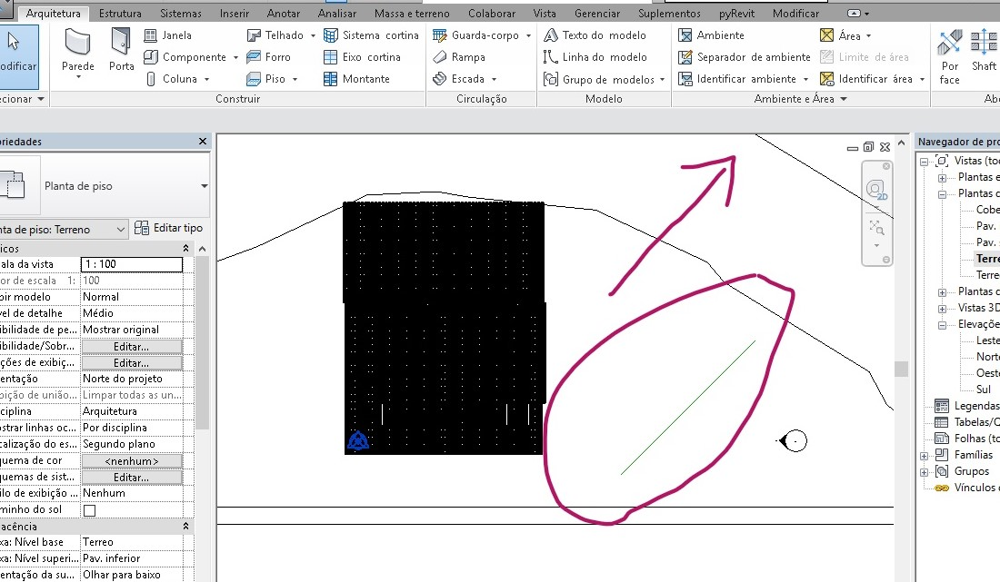
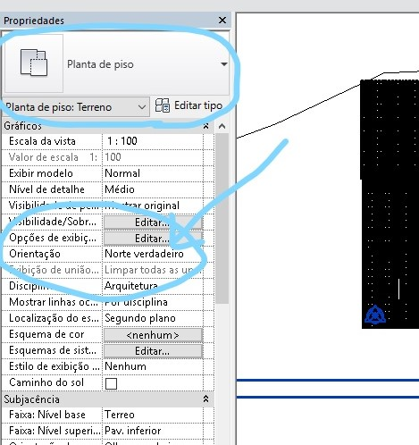
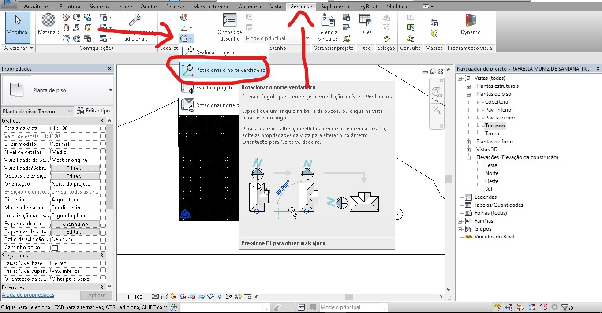
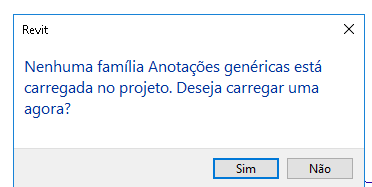
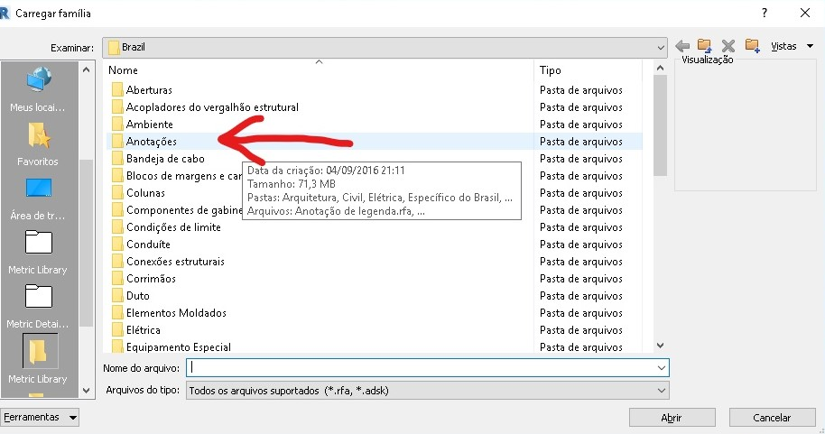

# Norte verdadeiro e norte de projetos

O Revit trabalha com dois conceitos de norte.

Um deles é o norte de projeto. Este não aponta para a direção geográfica, apenas indica a orientação em que seu projeto será desenhado e as quatro orientações das fachadas.

Geralmente começamos um projeto na posição que deixa a maior parte dos elementos paralelos aos eixos vertical e/ou horizontal das plantas.

Ajustar o ângulo do norte verdadeiro é importante para a orientação do projeto e, principalmente para realizar estudos de sombra.

Para colocar o norte verdadeiro na direção correta e preciso saber o ângulo entre o norte verdadeiro e os eixos de desenho, ou encontrar uma linha que seja paralela a este.

____

____

na figura acima, imagine que a linha de modelo em verde marca a direção do norte verdadeiro.

Antes de ajustar o valor, abra sua vista de **Terreno** (site) e, na paleta de propriedades ajuste a opção **orientação** para **Norte Verdadeiro**

____

____

Na aba **Gerenciar** procure o painel **Localização do Projeto** e o comando **Rotacionar Norte Verdadeiro**

____

____

Quando o comando é acionado uma linha aparece e a posição do ponteiro do *mouse* indica a nova direção do norte verdadeiro.

____

____

No extremo fixo da linha existe um ponto azul. Coloque o ponteiro do *mouse* neste ponto e arraste ate o ponto inicial da linha de referência. Quando a símbolo de end point aparecer, clique para reposicionar a linha de rotação.

____

____

Em seguida clique no outro extremo da linha. Rotacione a linha até que ela esteja alinhada com o eixo vertical do desenho. Clique o botão esquerdo do mouse indicando a nova direção do norte.

____

____

Agora a vista está orientada para o norte verdadeiro. A vista pode ser reorientada para o norte de projeto na opção **orientação** da **paleta de propriedades** da vista.

____

____

Com o norte verdadeiro configurado, qulaquer vista de planta pode ser orientada para o norte verdadeiro ou norte de projeto na **paleta de propriedades** da vista.

____
____

## Inserindo Símbolo de Norte

Antes de inserir um Símbolo de norte, abra a vista de planta onde deseja inserir o símbolo e mude a orientação da vista para norte verdadeiro.

Para inserir um símbolo de indicação de norte, na aba **Anotar**, no painel **Símbolos**, procure o comando **Símbolo**

____

____

Os *Templates* instalados com o Revit não carregam nenhuma família de símbolos (anotações genéricas). Neste caso, uma caixa de diálogo te dá a opção de inserir um símbolo de anotação genérica, clique em **sim** para inserir.

____

____

Caso já existam famílias de **anotações genéricas** inseridas, procure na **paleta de propriedades** por uma indicação de norte. Caso não tenha, vá em **carregar família** para inserir um símbolo a partir de um arquivo de família.

____

____

Clicando sim na mensagem ou optando por carregar uma família, o Revit abrira uma janela de seleção de arquivos. Procure a pasta anotações.

____

____

Na pasta anotações, procure o arquivo Seta norte-1.rfa. Clique em **abrir**.

____

____

Ao abrir o arquivo, o Revit retornará para a vista de planta selecionada. Clique no ponto onde deseja inserir o símbolo.

Com o símbolo de norte carregado no projeto, para inseri-lo em outras vistas, basta seguir os passos abaixo.

* No navegador de projeto, abra a vista de planta que deseja inserir o símbolo de norte;

* mude a orientação para norte verdadeiro;

* Na aba **Anotar**, clique no botão símbolo.

* Na **paleta de propriedades**, certifique-se que a seta de norte está aparecendo como o símbolo a ser inserido;

* Caso contrário, clique no **seletor de tipo** para colocar a seta de norte como o símbolo a ser inserido.

* clique no ponto onde deseja inserir o símbolo de norte.

* retorne a orientação da vista para o norte de projeto.

* repita a operação para as demais vistas.

### Editando o Símbolo de norte
