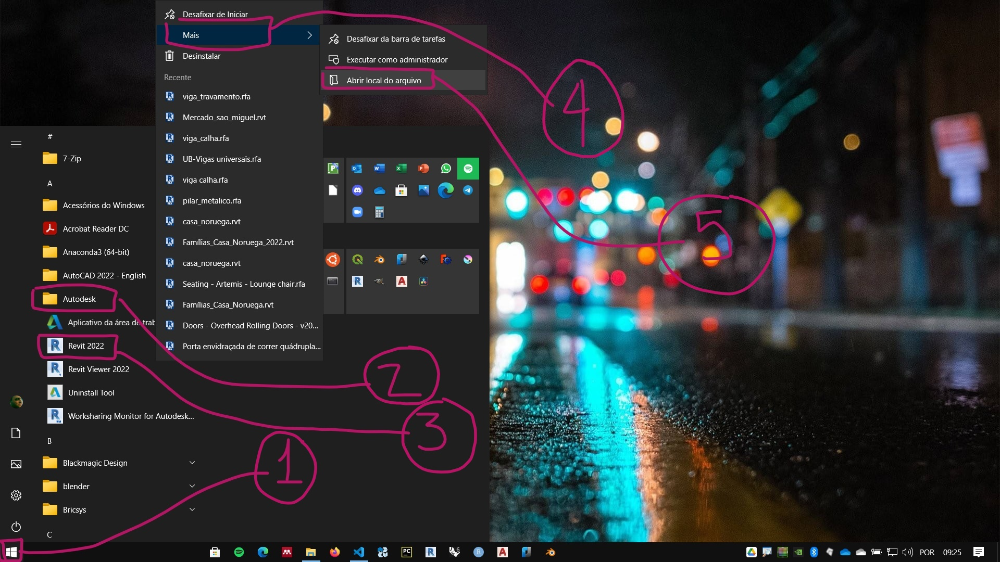

# Instalação do Revit


[Link Autodesk educacional Brasil](https://www.autodesk.com.br/education/edu-software/overview?sorting=featured&filters=individual)


[Instalação Revit 2022 - Canal Layout Arquitetura](https://www.youtube.com/watch?v=NW71aaIatlc)

[Corrigindo problemas na instação de famílias e templates do revit](https://knowledge.autodesk.com/pt-br/support/revit/troubleshooting/caas/sfdcarticles/sfdcarticles/PTB/Revit-Templates-and-families-not-installed.html)

## Mudando 0 idioma

O guia abaixo é dividido em duas partes:

A primeira, **Preparação**, mostra como organizar os arquivos do menu iniciar para mostrar duas opções, uma para abrir o Revit em português, outra em inglês.

A segunda, **Configuração do idioma**, mostra como configurar uma atalho para iniciar o Revit utilizando um outro idioma.

Os exemplos baseiam-se em uma instalação do **Revit 2022**, instalado em português, em um sistema operacional **Windows 10 Pro**, também instalado com o idioma português. 

### Preparação

1. Abra o menu iniciar
2. no menu iniciar, abra a pasta Autodesk
3. clique com o botão direito no ícone do Revit
4. escolha a opção mais
5. clique para abrir o local do arquivo

Essas ações vão abrir a pasta do Windows onde ficam os arquivos de atalho do menu iniciar utilizados para abrir o Revit.




Para manter atalhos para o Revit em mais de um idioma, é preciso criar uma cópia do arquivo de atalho. Neste exemplo estamos criando um atalho para o idioma inglês, em uma instalação inicial no idioma português.

O arquivo de atalho pode ser copiado utilizando as teclas ```ctrl + c```, e colado, utilizando as teclas ```ctrl + v```.


ou, clicando com o botão direito no nome do atalho e escolhendo a opção copiar. Em seguida, pode-se clicar na opção colar, no explorador sde arquivos, ou clicar com o botão direito no espaço vazio da tela do explorador de arquivos e escolher a opção colar.


Uma mensagem do sistema pode aparecer, exigindo requisitos de administrador para executar a tarefa. Caso estas mensagens apareçam em alguma das etapas deste guia, clique em continuar.


Para melhor organizar os atalhos, renomeie o arquivo copiado, colocando uma indicação do idioma que você quer configurar. Isso pode ser feito com a tecla ```F2```, ou clicando com o botão direito no arquivo e escolhendo a opção renomear.


Sugerimos o nome ```Revit 2022-eng``` para o atalho que estamos configurando para o idioma inglês.


### Configuração do idioma

As próximas etapas irão configurar propriamente o idioma do Revit.

Clique no arquivo com o botao direito e escolha a opção ```propriedades```.


Na caixa de diálogo de propriedades, no campo Destino. note que, após a indicação do caminho para o arquivo executável, aparece a opção e idioma na forma ```/language PTB```. Esse é o código para português do Brasil. 


Troque para ```/language ENU```, que indica o idioma Inglês nos estados Unidos (English United States). Aplique as alterações (2) ou clique no botão **OK**(3).


Agora, no menu iniciar, na pasta da Autodesk, aparecem dois atalhos para iniciar o Revit, um em português, outro em inglês.